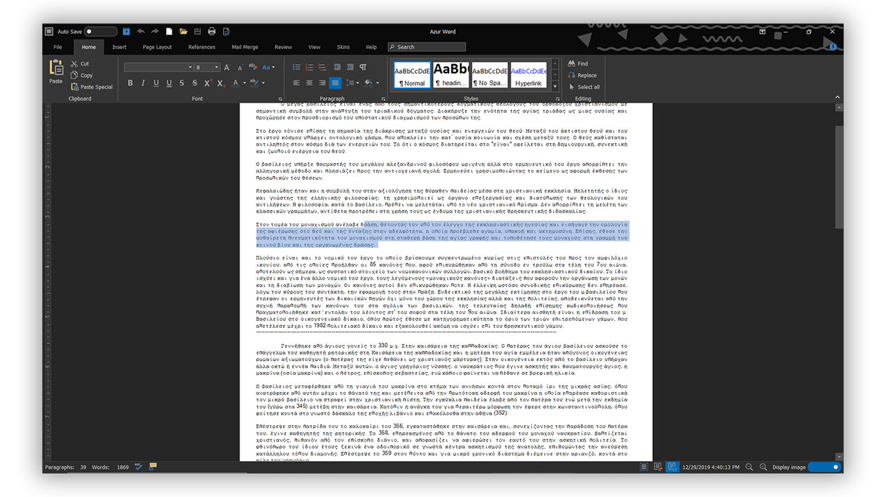
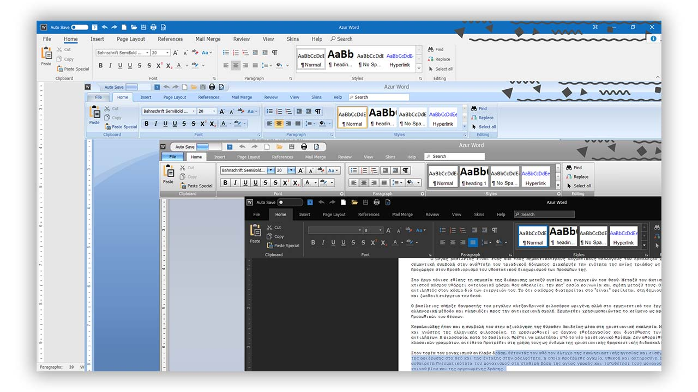
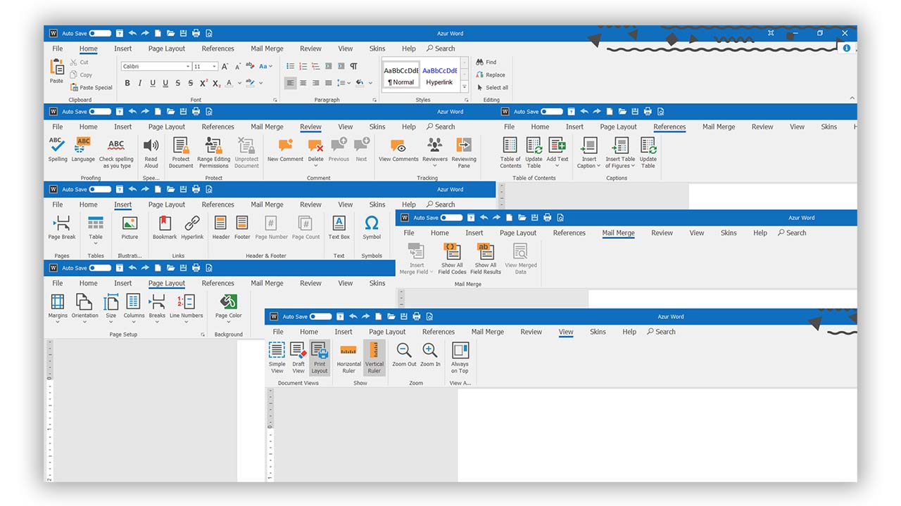
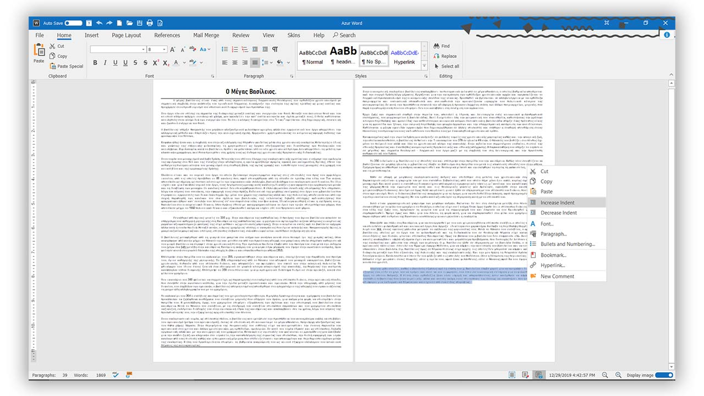
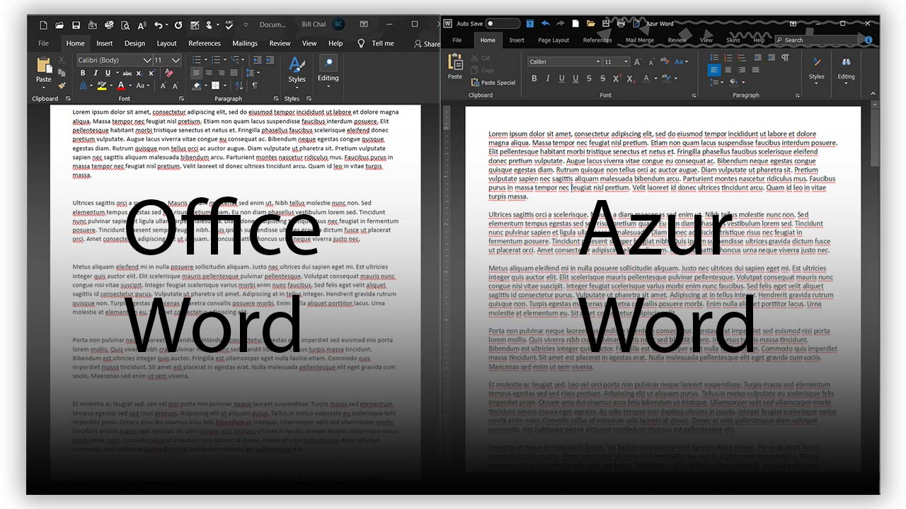

## Azur Word

 Advanced free word editor. <a href="https://drive.google.com/file/d/1_ZpGUgHJc7k4Wc1hPFfNZEdSWmit64db/view?usp=sharing">Download Setup file here</a> (removed)

 Version 2019 (Build 14.9.3) 

## A powerfull word editor with beautiful user interface

## More than 10+ skins available

## All the options you need to create what ever you can imagine

## All the Advanced options here

## Comparing the differences from Office Word and Azur Word

 <h2> Info: </h2> 

- 
Name of the project: "Azur Word"

- 
Current version: 2019 (Build 14.9.3) 

- 
C#

- 
Created in Visual Studio 2019 and <a href="https://www.devexpress.com/">DevExpress </a> 

- 
Framework you may need: <a href="https://dotnet.microsoft.com/download/dotnet-framework/net48">Net.Framework 4.8</a> 

- 
Only include the .exe and not the resource!

- 
Size of the file 'Setup': 57.8 MB (60,637,405 bytes) 

- 
It will be available for download only from Google Drive 

 <h2> Downloads: </h2> 

- 
Download from Google Drive <a href="https://drive.google.com/file/d/1_ZpGUgHJc7k4Wc1hPFfNZEdSWmit64db/view?usp=sharing"> here  </a>   (removed, avaliable in Summer)

<h2>license:</h2>

Author: Bill Chamalidis

Copyright (c). All rights Reserved

This program is free software: you can redistribute it and/or modify
    it under the terms of the <a href="https://www.gnu.org/licenses/gpl-3.0.en.html">GNU</a> General Public License as published by
    the Free Software Foundation, either version 3 of the License, or
    any later version.

